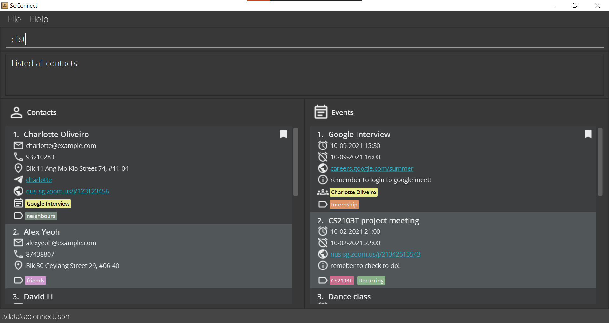
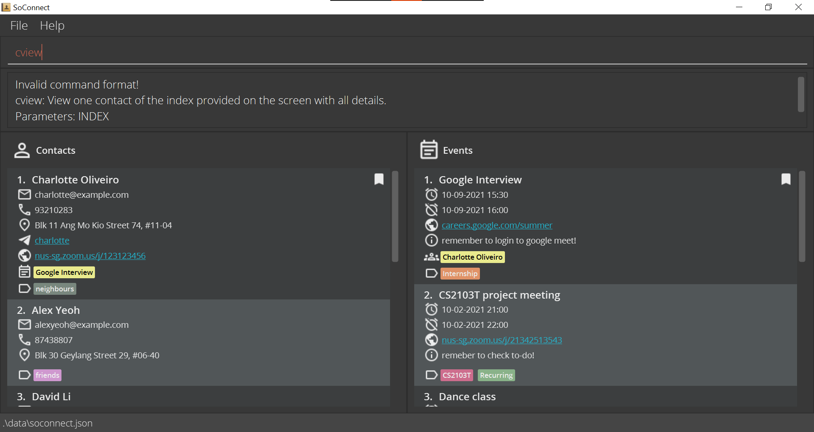
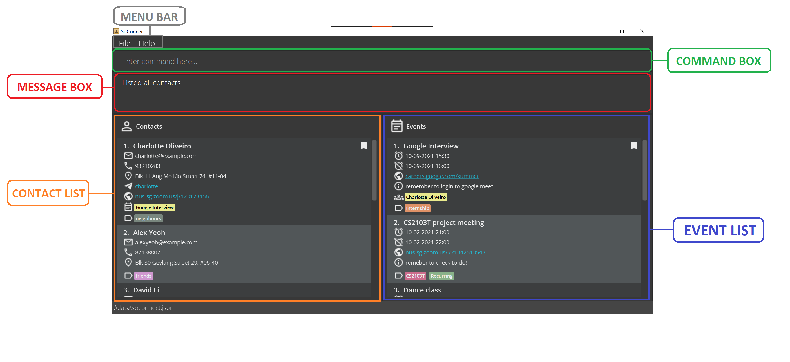
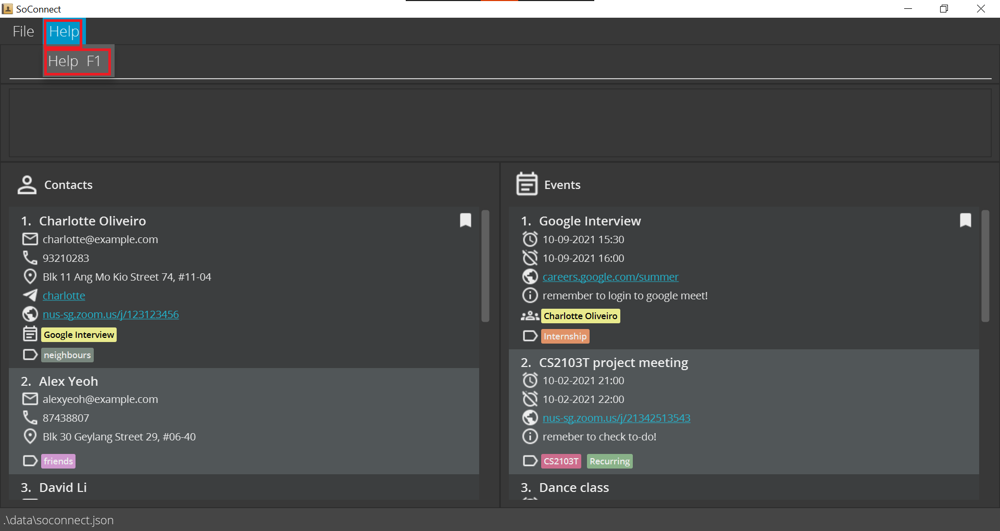
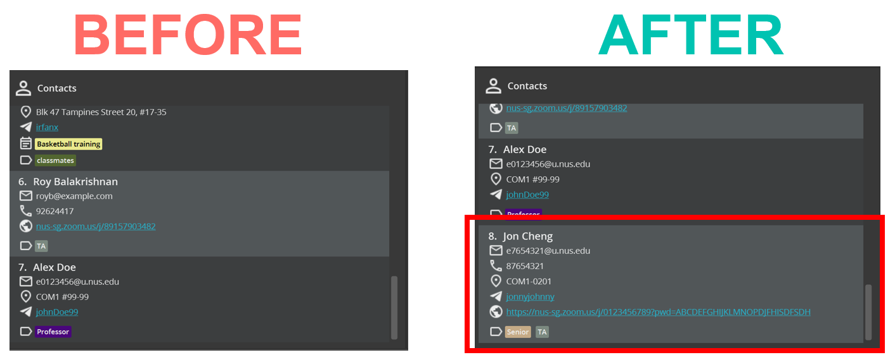
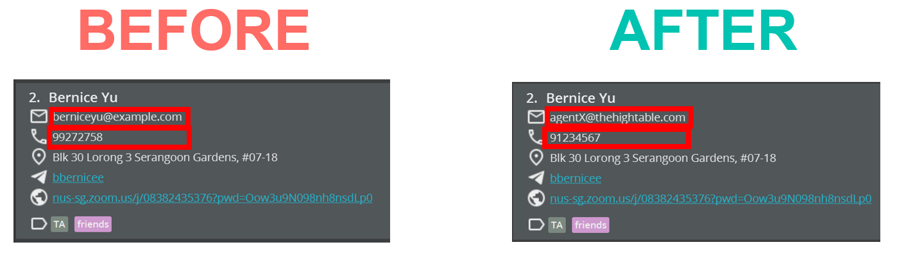
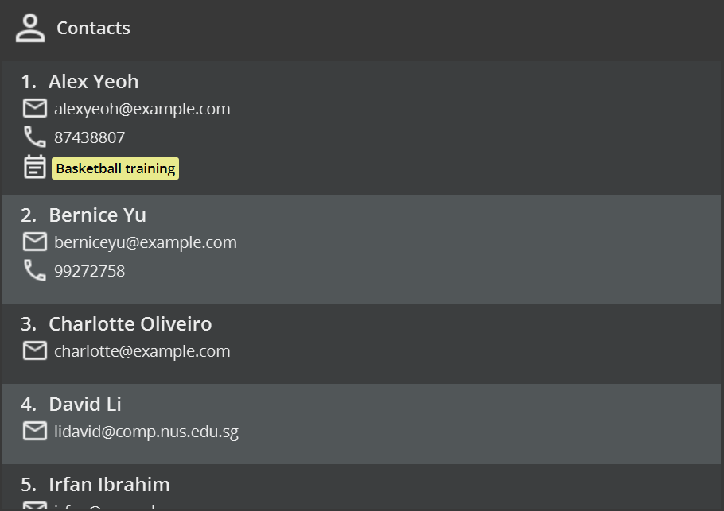
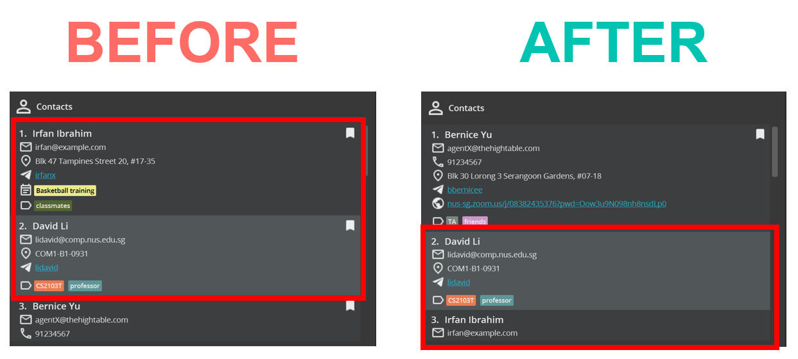
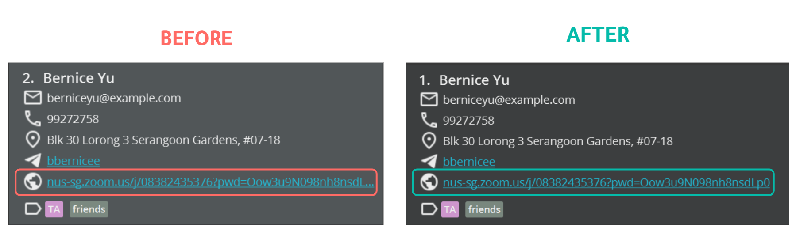
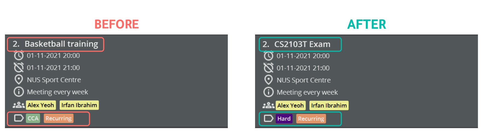

<<<<<<< HEAD
Made by _SoC_ students, **for SoC students**, SoConnect is a **desktop app that manages contacts of _Professors_ and _Teaching Assistants_ for you. 
It is also the goto app for managing noteworthy events, optimized for use via a _Command Line Interface (CLI)_** while still having 
the benefits of a _Graphical User Interface (GUI)_. If you can type fast, managing your contacts will be a **breeze** with SoConnect.

This User Guide aims to help you familiarise yourself with your SoConnect quickly and teach you the 
full range of features it offers. So start on this journey today with your new university buddy SoConnect, we promise you will not regret!
=======
Made by [School of Computing](https://www.comp.nus.edu.sg/) (SoC) students, for SoC students, SoConnect is a **desktop app for SoC students to manage contacts
of Professors and Teaching Assistants, and keep track of noteworthy events.** With SoConnect, you can **save 
your contacts and events in one location**, and even **link events to multiple contacts**, or **bookmark
your favorite contact**.

SoConnect is **optimized for use via a _Command Line Interface (CLI)_** while still having 
the benefits of a _Graphical User Interface (GUI)_. If you can type fast, managing your contacts will be
**very easy** with SoConnect.

This user guide will help you to familiarise yourself with your SoConnect quickly and teach you the
full range of features it offers.
>>>>>>> 954412eb42e15620f56a6b6b49b50dd506ed9c19

* Table of Contents
{:toc}

--------------------------------------------------------------------------------------------------------------------

## How to use SoConnect User Guide

<<<<<<< HEAD
* You can click on the titles in the Table of Contents to jump the section that you are interested in.
* You will find these icons useful in helping you read this user guide:
    * **:bulb: Tip** highlights additional information that might be useful to you.
=======
* You can click on the titles in the Table of Contents to jump to the section that you are interested in.
* You will find these icons in this user guide:
    * **:bulb: Tip** provides additional information that might be useful to you.
>>>>>>> 954412eb42e15620f56a6b6b49b50dd506ed9c19
    * **:information_source: Note** provides supplementary information that helps you to understand this User Guide.
    * **:exclamation: Caution** cautions you against certain actions that will lead to undesirable consequences.
* You can find explanations of _italicized_ words in the [Glossary](#glossary).
* You can refer to the [Command Summary](#command-summary) for a complete overview of all SoConnect features and _commands_.

### How to read _commands_ in SoConnect

<<<<<<< HEAD
You will see _commands_ throughout this User Guide and each of them have their own _Command Format_.
=======
You will see _commands_ throughout this User Guide and each of them has its own _Command Format_.
>>>>>>> 954412eb42e15620f56a6b6b49b50dd506ed9c19

This is one example of a _command_:

<<<<<<< HEAD

 
There are only 3 different parts of inputs within each command:
1. **COMMAND WORD**

    Command word is the word that you need to specify to tell SoConnect to do your bidding. 
    Else, SoConnect does not know how it can help you!

    For example, specifying `cedit` in the command above will tell SoConnect to edit a contact for you.

2. **_PARAMETER_**

    _Parameter_ is the supplementary information that you need to specify to SoConnect for the action you want to do.

    Using the same example, after telling SoConnect to edit a contact, you will need to tell SoConnect which contact to edit
and what information to edit.

    Specifying `2` tells SoConnect you want to edit contact at **index 2** and `Betsy Crower` 
is the **new name** you want to change the specified contact to.

3. **_PREFIX_**

    There's so many information for SoConnect to track! You can help SoConnect help you by separating the type of _parameters_ using prefixes.
    
    Just how a language has vocabulary, SoConnect has its very own vocabulary known as prefixes.

    Each prefix always ends with one `/`. Seems mind boggling? Jump to [List of Prefixes](#list-of-prefixes) to see all prefixes you can use in SoConnect.

    For example, if you use `n/`, SoConnect will recognise the information following this prefix should be a **name**.
=======
There are only 3 different parts of inputs within each _command_:
1. **_COMMAND_ WORD**

   You need to specify the _command_ word to tell SoConnect what action you want to do.

   For example, specifying `cedit` in the _command_ above will tell SoConnect to edit a contact for you.

2. **_PARAMETER_**

   The _parameter_ is the supplementary information that you need to provide for the action you want to do.

   Using the same example, specifying `2` tells SoConnect to edit the contact at **index 2** (the second contact in the list) to the name `Betsy Crower`.

3. **_PREFIX_**
>>>>>>> 954412eb42e15620f56a6b6b49b50dd506ed9c19

   The *prefix* separates the different types of *parameters*.

<<<<<<< HEAD
Putting it together, you can tell SoConnect to **edit the name of the contact at index 2 to Betsy Crower** by specifying `cedit 2 n/Betsy Crower`.

:bulb: **Tip:**

* Read more on _Command Format_ below, or
* Ready to learn more feature? click here [here](#Features)! 

=======
   Each _prefix_ always ends with a `/`. See the [list of _prefixes_](#list-of-prefixes) for all the _prefixes_ that you can use in SoConnect.

   For example, if you use `n/`, SoConnect will recognise that the information following this _prefix_ should be a **name**.
>>>>>>> 954412eb42e15620f56a6b6b49b50dd506ed9c19

You may view the entire list of _commands_ that you can type in SoConnect [here](#features).

<<<<<<< HEAD
**About the _Command Format_**
   
SoConnect boasts a suit of features that will help you manage your contacts and events. 

Learn how you can perform certain actions on SoConnect for each [feature](#Features) 
you can find in SoConnect.

Here are some information that can help you in understanding the formats at the later section!
=======
**:information_source: About the _Command_ format:** 
>>>>>>> 954412eb42e15620f56a6b6b49b50dd506ed9c19

* Words in `UPPER_CASE` are the _parameters_ that you should provide. 
  e.g. in `cadd n/NAME`, `NAME` is a _parameter_ that can be used as `cadd n/John Doe`.

* _Fields_ in **square brackets** are **optional**. 
  e.g `n/NAME [t/TAG]` can be used as `n/John Doe t/friend` or as `n/John Doe`.

* _Fields_ with `…`​ after them can be used multiple times including zero times. 
  e.g. `[t/TAG]…​` can be used as ` ` (i.e. 0 times), `t/friend`, `t/friend t/family`, etc.

* Each pair of _prefixes_ and _parameters_ can be in any order. 
  e.g. if the _command_ specifies `n/NAME [p/PHONE_NUMBER]`, `[p/PHONE_NUMBER] n/NAME` is also acceptable.

<<<<<<< HEAD
* If a _parameter_ is expected only once in the command, but you specify it multiple times, SoConnect will take **only the last occurrence** of the parameter. 
=======
* If a _parameter_ is expected only once in the _command_, but you specify it multiple times, **only the last occurrence** of the _parameter_ will be taken (unless otherwise stated). 
>>>>>>> 954412eb42e15620f56a6b6b49b50dd506ed9c19
  e.g. if you specify `p/12341234 p/56785678`, only `p/56785678` will be taken.

* Extraneous _parameters_ for _commands_ that do not take in _parameters_ (such as `help` and `exit`) will be **ignored**. 
  e.g. if the _command_ specifies `help 123`, it will be interpreted as `help`.

* Date and time must follow **dd-MM-yyyy HH:mm** format (day-month-year hours:minutes).
  e.g. if the date and time is 1 May 2021 6.30pm, you should specify it as `01-05-2021 18:30`

<<<<<<< HEAD
### How do i know if i entered the command correctly?

After you correctly typed a command on SoConnect, you will see a **success message** in the message box of SoConnect.

For example, after you specify [`clist`](#listing-all-contacts-clist):

SoConnect will notify you that it has successfully listed all contacts!
=======
### What happens if my _command_ is invalid?

After you enter a _command_ in SoConnect, a success message will be displayed on the message box of SoConnect.
>>>>>>> 954412eb42e15620f56a6b6b49b50dd506ed9c19

:bulb: **Tip:**

Unsure of where to find the **message box**? Click [here](#overview-of-soconnect) to check out the
overview of different components in SoConnect.

<<<<<<< HEAD
 

### What happens if my command is invalid?

However, when the command you entered does not follow the _Command Format_ specified in [Features](#features),
an **error message** will be shown on the message box instead.
=======
For example, after entering [`clist`](#listing-all-contacts-clist), SoConnect will tell you that it has successfully listed all contacts.

 

However, if the _command_ you entered does not fulfill the _Command Format_ specified in 
[Features](#features), an **error message** will be shown on the message box instead.
You can then correct your mistakes in the _command_ and try again.

For example, if you enter [`cview`](#viewing-a-contact-cview) **without** specifying which contact to view,
SoConnect will tell you that the _Command Format_ is invalid.
>>>>>>> 954412eb42e15620f56a6b6b49b50dd506ed9c19

<<<<<<< HEAD
SoConnect will warn you that the _Command Format_ is invalid!
=======
>>>>>>> 954412eb42e15620f56a6b6b49b50dd506ed9c19

--------------------------------------------------------------------------------------------------------------------
## Quick start

1. Ensure you have [Java 11](https://www.oracle.com/java/technologies/downloads/) or above installed on your computer.

   
:bulb: **Tip:**

   [Here](https://www.java.com/en/download/help/version_manual.html) is how you can check the Java Version installed on your computer.
   

2. Download the latest `soconnect.jar` from [here](https://github.com/AY2122S1-CS2103T-W15-3/tp/releases).

3. Copy the file to the folder you want to use as the _home folder_ for your SoConnect.

4. Double-click the file to start SoConnect. If you installed correctly, you should see something similar on your screen: 

<<<<<<< HEAD
    
    
    
:information_source: **Note:**
=======
   
>>>>>>> 954412eb42e15620f56a6b6b49b50dd506ed9c19

    
:information_source: **Note:**
   SoConnect comes with some sample contacts and events upon installation.
    

    
:bulb: **Tip:**
   If SoConnect does not start by double-clicking, you can check this 
   [alternative](#how-to-start-soconnect-using-terminal) way of starting SoConnect.
    

<<<<<<< HEAD
   
    If SoConnect does not start by double-clicking, you can try this [alternative](#how-to-start-soconnect-using-terminal) to start it too.

5. **Type a command in the command box and press Enter** to execute it. 

    
:bulb: **Tip:**

    Not sure where is the **command box**? Check out [Overview of SoConnect](#overview-of-soconnect) to view the different 
    sections you can find in SoConnect!
    

   Feeling lost and overwhelmed? Type `help` and **press Enter**, you will see the [help window](#help-window-help) open. 
   Some example commands you can try:
=======
5. Type the _command_ in the _command_ box and **press Enter** to execute it.

    
:bulb: **Tip:**
   Unsure of where to find the **_command_ box**? Click [here](#overview-of-soconnect) to check out the
   overview of different components in SoConnect.
    

   For example, typing `help` and **pressing Enter** will open the [help window](#help-window-help). 
   Here are some example _commands_ you can try:
>>>>>>> 954412eb42e15620f56a6b6b49b50dd506ed9c19

    * `elist`: [Lists all events](#listing-all-events-elist).

    * `cadd n/John Doe p/98765432 e/johnd@example.com a/John street, block 123, #01-01`:
   [Adds a contact](#adding-a-contact-cadd) named `John Doe` to SoConnect.

    * `cdelete 3` : [Deletes the third contact](#deleting-a-contact-cdelete) shown in SoConnect.

    * `eclear` : [Clears all entries of events](#clearing-all-events-eclear) from SoConnect.

    * `exit` : [Exits](#exiting-soconnect-exit) SoConnect.

6. Refer to the [Features](#features) below for details of each _command_.

_See also: [What happens if my command is invalid](#what-happens-if-my-command-is-invalid)_

--------------------------------------------------------------------------------------------------------------------

## Overview of SoConnect

This is what you should see when you open SoConnect!

1. **Menu Bar**

<<<<<<< HEAD
    Menu Bar consists if 2 tabs: `File` and `Help`.
    
    If you click `File`, you can choose to:
   1. **Exit** SoConnect
   2. Open **Calendar** of SoConnect
=======
   The Menu Bar consists of 2 tabs: `File` and `Help`.
>>>>>>> 954412eb42e15620f56a6b6b49b50dd506ed9c19

   Upon clicking `File`, you can choose to:
    1. **Exit** SoConnect
    2. Open **Calendar** of SoConnect

   

    
:bulb: **Tip:**
    Click the following links to see how to [exit SoConnect](#exiting-soconnect-exit) and [open the calendar](#calendar-window-calendar) using _commands_.
    
  

   Upon clicking `Help`, you can choose to open the **Help Window** of SoConnect.
   

    
:bulb: **Tip:**
   Check out how to open [the help window](#help-window-help) using _commands_.
    

<<<<<<< HEAD
    This is where you type your commands to use SoConnnect's [features of SoConnect](#features).
=======
2. **_Command_ Box**

   This is where you can type all your _commands_ to use the [features of SoConnect](#features).
>>>>>>> 954412eb42e15620f56a6b6b49b50dd506ed9c19

3. **Message Box**

   This is where the message from SoConnect is displayed after you have executed one _command_.

   _See Also: [What happens if my command is invalid?](#what-happens-if-my-command-is-invalid)_

5. **Contact List**

   Displays information of the contacts you saved in SoConnect.

   Refer to [Icons in Contact List](#icons-in-contact-list) to learn about the different _fields_ that each icon represents in Contact List.

6. **Event list**

   Displays information of the events you saved in SoConnect.

   Refer to [Icons in Event List](#icons-in-event-list) to learn about the different _fields_ that each icon represents in Event List.

### Icons in Contact List

<<<<<<< HEAD
You can always find these 2 information of each contact displayed in SoConnect Contact List:
1. Contact **Index**
2. Contact **Name**
=======
You will always find these 2 information of each contact displayed in SoConnect Contact List:
1. Contact Index
2. Contact Name
>>>>>>> 954412eb42e15620f56a6b6b49b50dd506ed9c19

Here are the icons you might see under each contact:

Icon | _Field_
--------|------------------
**** | Bookmark*
**** | Email Address
**** | Phone Number
**** | Address
**** | Telegram Handle
**** | Links/ Websites
**** | Linked Events
**** | Tag

<<<<<<< HEAD

:information_source: **Note:**

*Bookmark icon is only visible if the contact has been bookmarked. 
_See also: [Bookmarking a contact](#bookmarking-a-contact-cmark)_
=======
*The bookmark icon is only visible if the contact has been marked.
_See also: [Marking a contact](#marking-a-contact-cmark)_
>>>>>>> 954412eb42e15620f56a6b6b49b50dd506ed9c19

### Icons in Event List

<<<<<<< HEAD
You can always find these 2 information of each contact displayed in SoConnect Event List:
1. Event **Index**
2. Event **Name**
=======
You will always find these 2 information of each event displayed in SoConnect Event List:
1. Event Index
2. Event Name
>>>>>>> 954412eb42e15620f56a6b6b49b50dd506ed9c19

Here are the icons you might see under each event:

Icon | _Field_
--------|------------------
**** | Bookmark*
**** | Start Time
**** | End Time
**** | Links/ Websites
**** | Description
**** | Linked Contacts
**** | Tag

<<<<<<< HEAD

:information_source: **Note:**
   
*Bookmark icon is only visible if the event has been bookmarked.
_See also: [Bookmarking an event](#bookmarking-an-event-emark)_
=======
*The bookmark icon is only visible if the event has been marked.
_See also: [Marking an event](#marking-an-event-emark)_
>>>>>>> 954412eb42e15620f56a6b6b49b50dd506ed9c19

--------------------------------------------------------------------------------------------------------------------

## Features

There are three main sections to SoConnect Features:
[Contact Management](#contact-management),
[Event Management](#event-management), and
[General](#general).

:bulb:**Tip:**
   
Just starting off? We recommend you start with the **basic** features first.
Feeling adventurous? We welcome you to checkout SoConnect's **advanced** features.
   

For each feature, you will find:
* Function and Description of the feature
* _Command Format_ of the feature
<<<<<<< HEAD
* Examples of how to use the feature 

(All examples assumes SoConnect has the **inital sample** contacts and events)
=======
* Examples of some usages of the feature (All examples use the **initial sample** of contacts and events)
>>>>>>> 954412eb42e15620f56a6b6b49b50dd506ed9c19

--------------------------------------------------------------------------------------------------------------------

### Contact Management

This section details all the features and _commands_ available in SoConnect that can help you manage your contacts:

<<<<<<< HEAD
This section details all the features and commands you can use to tell SoConnect how to manage your contacts:

**Basic** features:
* [Adding a contact](#adding-a-contact-cadd)
=======
* [Adding a contact](#adding-a-contact-cadd)
* [Clearing all contacts](#clearing-all-contacts-cclear)
>>>>>>> 954412eb42e15620f56a6b6b49b50dd506ed9c19
* [Deleting a contact](#deleting-a-contact-cdelete)
* [Editing a contact](#editing-a-contact-cedit)
* [Finding contacts](#finding-contacts-cfind)
* [Listing all contacts](#listing-all-contacts-clist)
<<<<<<< HEAD

**Advanced** features: 
* [Bookmarking a contact](#bookmarking-a-contact-cmark)
* [Removing bookmark of a contact](#removing-bookmark-of-a-contact-cunmark)
=======
* [Marking a contact](#marking-a-contact-cmark)
* [Unmarking a contact](#removing-mark-of-a-contact-cunmark)
>>>>>>> 954412eb42e15620f56a6b6b49b50dd506ed9c19
* [Viewing a contact](#viewing-a-contact-cview)
* [Clearing all contacts](#clearing-all-contacts-cclear)

#### Adding a contact: `cadd`

You have just started learning a new module, is there a way to add the Professor and your TA's to SoConnect? Use `cadd`!

**Format:** `cadd n/NAME e/EMAIL [p/PHONE_NUMBER] [a/ADDRESS] [th/TELEGRAM_HANDLE] [z/ZOOM] [t/TAG]…`

<<<<<<< HEAD

:bulb: **Tip:**
A contact can have any number of tags (including 0)
=======

:bulb: **Tip:**

* A contact can have any number of tags (including 0)
* You **cannot** add a contact with the **same name** as an existing contact.
>>>>>>> 954412eb42e15620f56a6b6b49b50dd506ed9c19

**Examples:**

Input | Expected Output
------|------------------
<<<<<<< HEAD
`cadd n/Alex Doe e/e0123456@u.nus.edu a/COM1 #99-99 th/johnDoe99 t/Professor` | You should see this message in the message box: `New contact added: Alex Doe; Email: e0123456@u.nus.edu; Address: COM1 #99-99; Telegram: johnDoe99; Tags: [Professor]`    You should also see `Alex Doe` **at the end** of your contact list: 
`cadd n/ Jon Cheng t/TA e/e7654321@u.nus.edu a/COM1-0201 p/87654321 t/Senior th/jonnyjohnny z/https://nus-sg.zoom.us/j/0123456789?pwd=ABCDEFGHIJKLMNOPDJFHISDFSDH` | You should see this message in the message box: `New contact added: Jon Cheng; Email: e7654321@u.nus.edu; Phone: 87654321; Address: COM1-0201; Zoom Link: https://nus-sg.zoom.us/j/0123456789?pwd=ABCDEFGHIJKLMNOPDJFHISDFSDH; Telegram: jonnyjohnny; Tags: [Senior][TA]`   You should also see `Jon Cheng` **at the end** of your contact list:  

*Index of the newly added contact will be one more than your previous number of contacts.
=======
`cadd n/Alex Doe e/e0123456@u.nus.edu a/COM1 #99-99 th/johnDoe99 t/Professor` | You should see this message in the message box: `New contact added: Alex Doe; Email: e0123456@u.nus.edu; Address: COM1 #99-99; Telegram: johnDoe99; Tags: [Professor]`    You should also see `Alex Doe` added **at the end** of your contact list: 
`cadd n/ Jon Cheng t/TA e/e7654321@u.nus.edu a/COM1-0201 p/87654321 t/Senior th/jonnyjohnny z/https://nus-sg.zoom.us/j/0123456789?pwd=ABCDEFGHIJKLMNOPDJFHISDFSDH` | You should see this message in the message box: `New contact added: Jon Cheng; Email: e7654321@u.nus.edu; Phone: 87654321; Address: COM1-0201; Zoom Link: https://nus-sg.zoom.us/j/0123456789?pwd=ABCDEFGHIJKLMNOPDJFHISDFSDH; Telegram: jonnyjohnny; Tags: [Senior][TA]`   You should also see `Jon Cheng` added **at the end** of your contact list: 
>>>>>>> 954412eb42e15620f56a6b6b49b50dd506ed9c19

*Index of the newly added contact will be one more than the previous number of contacts.

<<<<<<< HEAD
### Deleting a contact: `cdelete`
=======
#### Clearing all contacts: `cclear`

Clears **all** entries of contacts in SoConnect.

**Format:** `cclear`

:bulb: **Tip:**

This **will not change the events** saved in SoConnect.

#### Deleting a contact: `cdelete`
>>>>>>> 954412eb42e15620f56a6b6b49b50dd506ed9c19

Your friend on exchange Bernice has left for her home country, you won't be contacting her anymore. 
Is there a way to delete a specified contact(s) from SoConnect? Use `cdelete`!

**Format:** `cdelete INDEX1[-INDEX2]`

* Deletes the contact(s):
<<<<<<< HEAD
  * at the specified `INDEX1` or 
  * from `INDEX1` to `INDEX2` inclusively (if you provide `INDEX2`).
* `INDEX` refers to the index number shown in the displayed contact list.
=======
    * at the specified `INDEX1` or
    * between the specified range from `INDEX1` to `INDEX2` inclusively (if you provide `INDEX2`).
* `INDEX1` and `INDEX2` refer to the index number shown in the displayed contact list.
>>>>>>> 954412eb42e15620f56a6b6b49b50dd506ed9c19

:bulb: **Tip:**

* `INDEX1` and `INDEX2` **must be a positive integer**. e.g. 1, 2, 3, …
* `INDEX1` and `INDEX2` must **not be greater** than the **number of contacts** in the contact list.

**Examples:**

Input | Expected Output
--------|------------------
<<<<<<< HEAD
[`clist`](#listing-all-contacts-clist) followed by `cdelete 2` | Deletes the second contact from SoConnect.    You should see these messages in the message box:   1. After `clist`: `Listed all contacts`   2. After `cdelete 2`: `Deleted Contact: Bernice Yu; Email: berniceyu@example.com; Phone: 99272758; Address: Blk 30 Lorong 3 Serangoon Gardens, #07-18; Zoom Link: nus-sg.zoom.us/j/08382435376?pwd=Oow3u9N098nh8nsdLp0; Telegram: bbernicee; Tags: [TA][friends]`  
[`cfind Bernice`](#finding-contacts-cfind) followed by `cdelete 1` | Deletes the first contact from the **results of the `cfind` command**.    You should see these messages in the message box:   1. After `cfind Bernice`: `1 contacts listed!`   2. After `cdelete 1`: `Deleted Contact: Bernice Yu; Email: berniceyu@example.com; Phone: 99272758; Address: Blk 30 Lorong 3 Serangoon Gardens, #07-18; Zoom Link: nus-sg.zoom.us/j/08382435376?pwd=Oow3u9N098nh8nsdLp0; Telegram: bbernicee; Tags: [TA][friends]`  
[`cdelete 3-5`](#deleting-a-contact-cdelete) | Deletes contacts from index 3 to 5 from the **currently displayed** contact list.    You should see these messages in the message box: `Deleted Contact: Charlotte Oliveiro; Email: charlotte@example.com`   `Deleted Contact: David Li; Email: lidavid@comp.nus.edu.sg; Address: COM1-B1-0931; Telegram: lidavid; Tags: [professor][CS2103T]`   `Deleted Contact: Irfan Ibrahim; Email: irfan@example.com; Address: Blk 47 Tampines Street 20, #17-35; Telegram: irfanx; Tags: [classmates]`  

=======
[`clist`](#listing-all-contacts-clist) followed by `cdelete 2` | Deletes the second contact in the contact list.    You should see these messages in the message box:   1. After `clist`: `Listed all contacts`   2. After `cdelete 2`: `Deleted Contact: Bernice Yu; Email: berniceyu@example.com; Phone: 99272758; Address: Blk 30 Lorong 3 Serangoon Gardens, #07-18; Zoom Link: nus-sg.zoom.us/j/08382435376?pwd=Oow3u9N098nh8nsdLp0; Telegram: bbernicee; Tags: [TA][friends]`
[`cfind Bernice`](#finding-contacts-cfind) followed by `cdelete 1` | Deletes the first contact in the **results of the `cfind` _command_**.    You should see these messages in the message box:   1. After `cfind Bernice`: `1 contacts listed!`   2. After `cdelete 1`: `Deleted Contact: Bernice Yu; Email: berniceyu@example.com; Phone: 99272758; Address: Blk 30 Lorong 3 Serangoon Gardens, #07-18; Zoom Link: nus-sg.zoom.us/j/08382435376?pwd=Oow3u9N098nh8nsdLp0; Telegram: bbernicee; Tags: [TA][friends]`
`cdelete 3-5` | Deletes contacts from indexes 3 to 5 (inclusive) from the **currently displayed** contact list.    You should see these messages in the message box: `Deleted Contact: Charlotte Oliveiro; Email: charlotte@example.com Deleted Contact: David Li; Email: lidavid@comp.nus.edu.sg; Address: COM1-B1-0931; Telegram: lidavid; Tags: [professor][CS2103T] Deleted Contact: Irfan Ibrahim; Email: irfan@example.com; Address: Blk 47 Tampines Street 20, #17-35; Telegram: irfanx; Tags: [classmates]`
>>>>>>> 954412eb42e15620f56a6b6b49b50dd506ed9c19

#### Editing a contact: `cedit`

<<<<<<< HEAD
Oh no! You accidentally entered the first contact name wrongly? How can you edit an existing contact in SoConnect? Use `cedit`!
=======
Edits an **existing** contact in SoConnect.
>>>>>>> 954412eb42e15620f56a6b6b49b50dd506ed9c19

**Format:** `cedit INDEX [n/NAME] [e/EMAIL] [p/PHONE] [a/ADDRESS] [th/TELEGRAM_HANDLE] [z/ZOOM] [dt/TAG_DELETED]… [t/TAG_ADDED]… `

* Edits the contact at the specified `INDEX`.
* `INDEX` refers to the index number shown in the displayed contact list.
* You must provide **at least one** of the optional _fields_.
* The input values you provide will be used to update the existing values.
* You can use `t/` to add a tag.
* You can remove a specific tag by typing `dt/` followed by the name of the tag that you wish to remove.
* You can remove all existing tags of a contact by typing `dt/*`.
* When editing tags, the tags to be deleted will be removed first, before new tags are added.

:bulb: **Tip:**

* `INDEX` **must be a positive integer**. e.g. 1, 2, 3, …
* `INDEX` must **not be greater** than the **number of contacts** in the contact list.
* You **cannot** edit a contact to the **same name** as an existing contact.

**Examples:**

Input | Expected Output
--------|------------------
<<<<<<< HEAD
`cedit 2 p/91234567 e/agentX@thehightable.com dt/TA dt` | Edits the **phone number** and **email address** of the second contact of **currently displayed** contact list to be `91234567` and `agentX@thehightable.com` respectively.    You should see this message in the message box:  `Edited Contact: Bernice Yu; Email: agentX@thehightable.com; Phone: 91234567; Address: Blk 30 Lorong 3 Serangoon Gardens, #07-18; Zoom Link: nus-sg.zoom.us/j/08382435376?pwd=Oow3u9N098nh8nsdLp0; Telegram: bbernicee; Tags: [TA][friends]`    You should also see these changes: 
`cedit 1 n/Aiken Dueet dt/*` | Edits the **name** of the first contact of **currently displayed** contact list to be `Aiken Dueet` and **clears all existing tags**.   You should see this message in your message box: `Edited Contact: Aiken Dueet; Email: alexyeoh@example.com; Phone: 87438807; Address: Blk 30 Geylang Street 29, #06-40; Telegram: yeoh_alex`    You should also see these changes: 

=======
`cedit 2 p/91234567 e/agentX@thehightable.com` | Edits the **phone number** and **email address** of the second contact in the **currently displayed** contact list to be `91234567` and `agentX@thehightable.com` respectively.    You should see this message in the message box:  `Edited Contact: Bernice Yu; Email: agentX@thehightable.com; Phone: 91234567; Address: Blk 30 Lorong 3 Serangoon Gardens, #07-18; Zoom Link: nus-sg.zoom.us/j/08382435376?pwd=Oow3u9N098nh8nsdLp0; Telegram: bbernicee; Tags: [TA][friends]`    You should also the following changes: 
`cedit 1 n/Betsy Crower dt/*` | Edits the **name** of the first contact in the **currently displayed** contact list to be `Betsy Crower` and **clears all existing tags**.   You should see this message in your message box: `Edited Contact: Betsy Crower; Email: alexyeoh@example.com; Phone: 87438807; Address: Blk 30 Geylang Street 29, #06-40; Telegram: yeoh_alex`    You should also see the following changes: 
>>>>>>> 954412eb42e15620f56a6b6b49b50dd506ed9c19

#### Finding contacts: `cfind`

<<<<<<< HEAD
You want to find how many of your contacts have Hans in their name, how do you do that? Use `cfind`!
=======
Finds all contacts that contain any of the given keywords that you specify.
>>>>>>> 954412eb42e15620f56a6b6b49b50dd506ed9c19

**Format:** `cfind [KEYWORD]… [e/KEYWORD…] [p/KEYWORD…] [a/KEYWORD…] [th/KEYWORD…] [z/KEYWORD…] [t/KEYWORD…]`

:bulb: **Tip:**

<<<<<<< HEAD
There are two types of contact searches you can do in SoConnect:
1. If you **do not** specify any **optional _prefixes_ before your keywords**, e.g. `cfind KEYWORD1 KEYWORD2`,

   By **default**, SoConnect will only search the names of the contacts based on the keywords you provide.

2. If you **specify optional prefix** before your keyword, e.g. `cfind e/KEYWORD1 p/KEYWORD2`,

   SoConnect will use `KEYWORD1 to search the emails and `KEYWORD2` to search phone numbers of the contacts to find you the relevant contact(s).

* You need to provide **at least one keyword**.
* You can provide **multiple keywords without** specifying any **optional _prefix_**.
* You can only **specify each optional _prefix_ once**.
* The **order** in which you specify the **keywords does not matter**. e.g. `Hans Bo` and `Bo Hans` will return the same contact(s).
* **Partial words** can be matched e.g. `Han` will match a contact with name `Hans`.
* Contact matching **at least one keyword** will be returned.
  e.g. `Hans Bo` will return the contacts with names `Hans Gruber` and `Bo Yang` respectively.
=======
There are **two** types of contact searches you can do in SoConnect:
1. If you **do not specify any optional _fields_** in front of the keywords you specify, e.g. `cfind KEYWORD1 KEYWORD2`,

   SoConnect will only search the names of the contacts using the keywords you provide.

2. If you specified optional _field(s)_ before a keyword, e.g. `cfind e/KEYWORD1 p/KEYWORD2`,

   SoConnect will search the emails and phone numbers of the contacts using `KEYWORD1` and `KEYWORD2` respectively.

* You must provide **at least one keyword**.
* You can provide multiple keywords without specifying any optional _fields_ e.g. `cfind John David`.
* You can only **specify each optional _field_ once**.
* You can the keywords **in any order**. e.g. Both `Hans Bo` and `Bo Hans` will return the same result.
* Partial words can be matched e.g. `Han` will match `Hans`.
* The contact(s) matching at least one keyword you provide will be returned.
  e.g. `Hans Bo` will return `Hans Gruber` and `Bo Yang`.
>>>>>>> 954412eb42e15620f56a6b6b49b50dd506ed9c19

:bulb: **Tip:**

The search by `cfind` is case-insensitive. e.g. `hans` will match `Hans`.

**Examples:**

Input | Expected Output
--------|------------------
`cfind alex david` | Returns contacts of `Alex Yeoh` and `David Li`.   You should see this message in the message box: `2 contacts listed!`   You should also see only these **2 contacts**: 
`cfind p/926 e/nus.edu` | Returns contacts with phone numbers that contain `926` and with emails that contain `nus.edu`.  You should see this message in the message box: `2 contacts listed!`   You should also see only these **2 contacts**: 

<<<<<<< HEAD

### Listing all contacts: `clist`

You want to look through the phone numbers of all your contacts. Use `clist`! 

**Format:** `clist [e/] [p/] [a/] [th/] [z/] [t/]`

* Contact **names** are **always shown**.
* If you **do not provide any optional _prefix_**, i.e. `clist`, all available details of each contact will be shown **by default**.
* If you **provide optional _prefix(es)_**, it will only show the names and the **corresponding specified _field(s)_** for each contact.
* You can provide **more than one type of** optional _field_ e.g. `clist e/ th/` tells SoConnect to display only the name, email and telegram handle of each contact.
* The **order** in which you provide the optional _prefixes_ **does not matter**. e.g. **both** `clist e/ p/` and `clist p/ e/` will show only the names, email addresses and phone numbers of each contact.
* If a contact **does not have a certain field**, that contact's _field_ **will not appear**, e.g. typing `clist th/` will not display the telegram handle of a contact that does not have a telegram handle.
=======
#### Listing all contacts: `clist`

Shows **all contacts** in the SoConnect, with all available details by default.

**Format:** `clist [e/] [p/] [a/] [th/] [z/] [t/]`

* Names of contacts are always shown.
* If you do not provide any optional _prefixes_, e.g `clist`, all available details of each contact will be shown.
* If you provide optional _prefixes_, it will only show the names and the _fields_ corresponding to specified _prefixes_ for each contact.
* You can provide more than one optional _prefix_.
* You can specify the optional _prefix_ **in any order**. e.g. both `clist e/ p/` and `clist p/ e/` will show only the names, email addresses and phone numbers of each contact.
* _Fields_ of a contact that have no value will not appear e.g. if a contact does not have a zoom link, typing `clist z/` will not display the zoom link of this contact.
>>>>>>> 954412eb42e15620f56a6b6b49b50dd506ed9c19

:bulb: **Tip:**

**Do not** add extraneous values after each optional _prefix_ you specify.

**Examples:**

Input | Expected Output
--------|------------------
`clist` | Shows **all available details** of each contact in SoConnect.    You should see this message in the message box:  `Listed all contacts`
`clist e/ p/` | Shows **only the names, email addresses and phone numbers** (if available) of each contact in SoConnect.    You should see this message in the message box:  `Listed all contacts`    You should also see the contacts list displays **only the specified _fields_**: 

#### Marking a contact: `cmark`

Marks the specified contact(s).

<<<<<<< HEAD

### Bookmarking a contact: `cmark`

You have weekly meetings with your CS2103T group mates Irfan and David, you want to pin their contact so that you can contact them for meetings more easily. Use `cmark`! 

**Format:** `cmark INDEX [INDEX]...`

* Bookmarks the contact(s) at `INDEX` and **pins it at the top** of the contact list.
* You can provide **more than one** `INDEX`, the marked contacts will appear in **reverse order** to the order in which you specified the indexes, e.g. `cmark 1 2`, the second contact will appear above the first.
* `INDEX` refers to the index number shown in the **currently displayed** contact list.

:information_source: **Note:**

`INDEX` **must be a positive integer**, e.g. 1, 2, 3,…

**Examples:**

Input | Expected Output
----------|------------------
`cmark 2` | Bookmarks the second contact of the **currently displayed** contact list in SoConnect.    You should see this message in the message box:  `Marked Contact: Bernice Yu; Email: berniceyu@example.com; Phone: 99272758; Address: Blk 30 Lorong 3 Serangoon Gardens, #07-18; Zoom Link: nus-sg.zoom.us/j/08382435376?pwd=Oow3u9N098nh8nsdLp0; Telegram: bbernicee; Tags: [TA][friends]`    You should see `Bernice Yu` **pinned to the top** of your contact list with the **Bookmark Icon** 
`cmark 4 5` | Bookmarks the fourth and fifth contact of the **currently displayed** contact list in SoConnect.    You should see this message in the message box:  `Marked contact: Irfan Ibrahim; Email: irfan@example.com; Address: Blk 47 Tampines Street 20, #17-35; Telegram: irfanx; Tags: [classmates]
Marked contact: David Li; Email: lidavid@comp.nus.edu.sg; Address: COM1-B1-0931; Telegram: lidavid; Tags: [professor][CS2103T]`    You should see `Irfan Ibrahim` and `David Li` **pinned, in this order, to the top** of your contact list with the **Bookmark Icon**  

_See also: [Removing bookmark of a contact](#removing-bookmark-of-a-contact-cunmark)_

### Removing bookmark of a contact: `cunmark`

Using `cmark` command, you realise the number of contacts you pinned is exploding, how do unpin contacts you no longer contact frequently? Use `cunmark`! 

**Format:** `cunmark INDEX [INDEX]...`

* **Removes** the bookmark of the contact(s) at `INDEX`.
* This **unmarked** contact(s) will be placed **after** all bookmarked contacts.
* You can provide **more than one** `INDEX`, the unmarked contacts will appear after the marked contacts in **reverse order** to the order in which you specified the indexes
e.g. `cunmark 2 3`, the third event will be placed above the second.
* `INDEX` refers to the index number shown in the displayed contact list.

:information_source: **Note:**
* `INDEX` **must be a positive integer**, e.g. 1, 2, 3,… 
* You must ensure that the contact indexed at `INDEX` is **initially bookmarked**.
=======
**Format:** `cmark INDEX [INDEX]...`

* Marks the contact at `INDEX` and **pins it at the top** of the contact list.
* You can specify more than one `INDEX`, e.g `cmark 1 2`, the order in which the marked contacts appear will be in reverse order to the order you specify their corresponding indexes.
* `INDEX` refers to the index number shown in the **currently displayed** contact list.

:bulb: **Tip:**

* `INDEX` **must be a positive integer**, e.g. 1, 2, 3,…
* `INDEX` must **not be greater** than the **number of contacts** in the contact list.

**Examples:**

Input | Expected Output
--------|------------------
`cmark 2` | Marks the second contact of the **currently displayed** contact list in SoConnect.    You should see this message in the message box:  `Marked Contact: Bernice Yu; Email: berniceyu@example.com; Phone: 99272758; Address: Blk 30 Lorong 3 Serangoon Gardens, #07-18; Zoom Link: nus-sg.zoom.us/j/08382435376?pwd=Oow3u9N098nh8nsdLp0; Telegram: bbernicee; Tags: [TA][friends]`    You should see `Bernice Yu` **pinned to the top** of your contact list with the **Bookmark Icon**: 
`cmark 4 5` | Marks the fourth and fifth contacts of the **currently displayed** contact list in SoConnect.    You should see this message in the message box:  `Marked contact: Irfan Ibrahim; Email: irfan@example.com; Address: Blk 47 Tampines Street 20, #17-35; Telegram: irfanx; Tags: [classmates] Marked contact: David Li; Email: lidavid@comp.nus.edu.sg; Address: COM1-B1-0931; Telegram: lidavid; Tags: [professor][CS2103T]`    You should see `Irfan Ibrahim` and `David Li` **pinned to the top** of your contact list in that order with the **Bookmark Icon**: 

_See also: [Unmarking a contact](#removing-mark-of-a-contact-cunmark)_

#### Removing mark of a contact: `cunmark`

Unmarks the specified contact(s).

**Format:** `cunmark INDEX [INDEX]...`

* Unmarks the contact at `INDEX1`.
* You may unmark **more than one contact at a time** by specifying multiple indexes, eg `cunmark 1 2`, the indexes in which the contacts appear will be **in the order in which** you specify them
* `INDEX`  refers to the index number shown in the displayed contact list.

:bulb: **Tip:**

* `INDEX` **must be a positive integer**, e.g. 1, 2, 3,…
* `INDEX` must **not be greater** than the **number of contacts** in the contact list.
*  You must check that the contact indexed at `INDEX` is **initially marked**.
>>>>>>> 954412eb42e15620f56a6b6b49b50dd506ed9c19

**Examples:**

Input | Expected Output
<<<<<<< HEAD
------------|------------------
`cunmark 2` | Removes bookmark of the second contact of **currently displayed** contact list in SoConnect.    You should see this message in the message box:  `Unmarked Contact: Bernice Yu; Email: berniceyu@example.com; Phone: 99272758; Address: Blk 30 Lorong 3 Serangoon Gardens, #07-18; Zoom Link: nus-sg.zoom.us/j/08382435376?pwd=Oow3u9N098nh8nsdLp0; Telegram: bernicee; Tags: [TA][friends]`    You should see the contact card of `Bernice Yu` without the **Bookmark Icon** and replaced **after all unmarked contacts** 
`cunmark 1 2` | Removes bookmark of the first and second contact of **currently displayed** contact list in SoConnect.    You should see this message in the message box:  `Unmarked contact: David Li; Email: lidavid@comp.nus.edu.sg; Address: COM1-B1-0931; Telegram: lidavid; Tags: [professor][CS2103T] Unmarked contact: Irfan Ibrahim; Email: irfan@example.com; Address: Blk 47 Tampines Street 20, #17-35; Telegram: irfanx; Tags: [classmates]`    You should see the contact cards of `David Li` and `Irfan Ibrahim` without the **Bookmark Icon** and replaced **after all unmarked contacts** 
 
_See also: [Bookmarking a contact](#bookmarking-a-contact-cmark)_

### Viewing a contact: `cview`
=======
--------|------------------
[`cmark 2 3`](#marking-a-contact-cmark) followed by `cunmark 1` | Unmarks the first contact of the **currently displayed** contact list in SoConnect.    You should see these messages in the message box:  1. After `cmark 2 3`: `Marked contact: Charlotte Oliveiro; Email: charlotte@example.com Marked contact: Bernice Yu; Email: berniceyu@example.com; Phone: 99272758; Address: Blk 30 Lorong 3 Serangoon Gardens, #07-18; Zoom Link: nus-sg.zoom.us/j/08382435376?pwd=Oow3u9N098nh8nsdLp0; Telegram: bbernicee; Tags: [TA][friends]`   2. After `cunmark 1`: `Unmarked contact: Charlotte Oliveiro; Email: charlotte@example.com`    You should see `Charlotte Oliveiro` moved to the **bottom of your marked contact list** without the **Bookmark Icon**: 
[`cmark 1 2 3`](#marking-a-contact-cmark) followed by `cunmark 1 2` | Unmarks the first and second contact of the **currently displayed** contact list in SoConnect.    You should see these messages in the message box:  1. After `cmark 1 2 3`: `Marked contact: Charlotte Oliveiro; Email: charlotte@example.com Marked contact: Bernice Yu; Email: berniceyu@example.com; Phone: 99272758; Address: Blk 30 Lorong 3 Serangoon Gardens, #07-18; Zoom Link: nus-sg.zoom.us/j/08382435376?pwd=Oow3u9N098nh8nsdLp0; Telegram: bbernicee; Tags: [TA][friends] Marked contact: Alex Yeoh; Email: alexyeoh@example.com; Phone: 87438807; Address: Blk 30 Geylang Street 29, #06-40; Telegram: yeoh_alex; Tags: [friends]`   2. After `cunmark 1 2`: `Unmarked contact: Bernice Yu; Email: berniceyu@example.com; Phone: 99272758; Address: Blk 30 Lorong 3 Serangoon Gardens, #07-18; Zoom Link: nus-sg.zoom.us/j/08382435376?pwd=Oow3u9N098nh8nsdLp0; Telegram: bbernicee; Tags: [TA][friends] Unmarked contact: Charlotte Oliveiro; Email: charlotte@example.com`    You should see `Bernice Yu` and `Charlotte Oliveiro` moved to the **bottom of your marked contact list** without the **Bookmark Icon**: 

_See also: [Marking a contact](#marking-a-contact-cmark)_

#### Viewing a contact: `cview`
>>>>>>> 954412eb42e15620f56a6b6b49b50dd506ed9c19

You want to email your assignment to Bernice, your TA, however, her email is truncated, what can you do? Use `cview`! 

**Format:** `cview INDEX`

* displays only the contact at the specified `INDEX`.
* All truncated details of the contact you want to view will be expanded fully.
* `INDEX` refers to the index number shown in the displayed contact list.

**:bulb: Tip:**  
* `INDEX` **must be a positive integer**. e.g. 1, 2, 3, …  
* `INDEX` must **not be greater** than the **number of contacts** in the contact list.

**Examples:**

Input | Expected Output
--------|------------------
`cview 2` | Shows all details of the second contact of the **currently displayed** in SoConnect **fully**.   You should see this message in the message box:  `Viewing Contact: Bernice Yu; Email: berniceyu@example.com; Phone: 99272758; Address: Blk 30 Lorong 3 Serangoon Gardens, #07-18; Zoom Link: nus-sg.zoom.us/j/08382435376?pwd=Oow3u9N098nh8nsdLp0; Telegram: bbernicee; Tags: [TA][friends]`    You should see this change of your **viewed** contact: 

<<<<<<< HEAD

### Clearing all contacts: `cclear`

You have a bunch of outdated contacts and you want to delete them all at once, howdo you do that? Use `cclear`! 

**Format:** `cclear`

:information_source: **Note:**
This will not change the events saved in SoConnect. 

## Event Management

This section details all the features and commands you can use to tell SoConnect how to manage your events: 

**Basic** features:
=======
### Event Management

This section details all the features and _commands_ available in SoConnect that can help you with managing your events:
>>>>>>> 954412eb42e15620f56a6b6b49b50dd506ed9c19
* [Adding an event](#adding-an-event-eadd)
* [Clearing all event](#clearing-all-events-eclear)
* [Deleting an event](#deleting-an-event-edelete)
* [Editing an event](#editing-an-event-eedit)
* [Finding events](#finding-events-efind)
* [Listing all events](#listing-all-events-elist)
<<<<<<< HEAD

**Advanced** features:
* [Bookmarking an event](#bookmarking-an-event-emark)
* [Removing bookmark of an event](#removing-bookmark-of-an-event-eunmark)
=======
* [Marking an event](#marking-an-event-emark)
* [Removing mark of an event](#removing-mark-of-an-event-eunmark)
* [Sorting events](#sorting-events-esort)
* [Unlinking an event from contacts](#unlinking-an-event-from-contacts-eunlink)
>>>>>>> 954412eb42e15620f56a6b6b49b50dd506ed9c19
* [Viewing an event](#viewing-an-event-eview)
* [Linking an event to contacts](#linking-an-event-to-contacts-elink)
* [Unlinking an event from contacts](#unlinking-an-event-from-contacts-eunlink)
* [Sorting events](#sorting-events-esort)

#### Adding an event: `eadd`

After a stressful semester, you are looking forward to the year end summer party you have been planning, how do you tell SoConnect to help you keep track of this important event. Use `eadd`!

**Format:** `eadd n/NAME at/START_TIME [end/END_TIME] [d/DESCRIPTION] [a/ADDRESS] [z/ZOOM] [t/TAG]…​`

:bulb: **Tip:**

* An event can have any number of tags (including 0)
* You **cannot** add an event with the **same name** as an existing event.

:information_source: **Note:**

* Start time and End Time should be of format **dd-MM-yyyy HH:m** (date-MONTH-year HOUR:minute in 24-hour format).
* End Time should be **chronologically after** the Start Time.

**Examples:**

Input | Expected Output
--------|------------------
<<<<<<< HEAD
`eadd n/Summer Party at/12-12-2021 15:12 a/123, Clementi Rd, 1234665 t/fun` | You should see this message in the message box:  `New event added: Summer Party; Start: 12-12-2021 15:12; Address: 123, Clementi Rd, 1234665; Tags: [fun]`    You should also see `Summer Party` **at the end** of your event list: 

*Index of the newly added event will be one more than your previous number of events.
=======
`eadd n/Summer Party at/12-12-2021 15:12 a/123, Clementi Rd, 1234665 t/fun` | You should see this message in the message box:  `New event added: Summer Party; Start: 12-12-2021 15:12; Address: 123, Clementi Rd, 1234665; Tags: [fun]`    You should also see `Summer Party` **at the end** of your event list: 

*Index of the newly added event will depend on your previous number of events.

#### Clearing all events: `eclear`

Clears all entries of events from SoConnect.

**Format:** `eclear`

:bulb: **Tip:**
This will not change the contacts saved in SoConnect. 

>>>>>>> 954412eb42e15620f56a6b6b49b50dd506ed9c19

#### Deleting an event: `edelete`

<<<<<<< HEAD
It has been a fruitful week, on top of your busy schedule you attended basketball training on monday, dance class on wednessday and you want a way to delete events that have passed. Use `edelete`!

**Format:** `edelete INDEX1[-INDEX2]`

* Deletes the event at:
=======
Deletes the specified event(s) from SoConnect.

**Format:** `edelete INDEX1[-INDEX2]`

* Deletes the event(s) at:
>>>>>>> 954412eb42e15620f56a6b6b49b50dd506ed9c19
    * the specified `INDEX1` or
    * between the specified range from `INDEX1` to `INDEX2` inclusively (if you provide `INDEX2`).
* `INDEX1` and `INDEX2` refer to the index numbers shown in the displayed event list.

:bulb: **Tip:**

* `INDEX1` and `INDEX2` **must be a positive integer**. e.g. 1, 2, 3, …
* `INDEX1` and `INDEX2` must **not be greater** than the **number of events** in the event list.

**Examples:**

Input | Expected Output
--------|------------------
<<<<<<< HEAD
[`elist`](#deleting-an-event-edelete) followed by `edelete 2` | Deletes the second event from the event list.    You should see these messages in the message box:  1. After `elist`: `Listed all events`  2. After `edelete 2`: `Deleted Event: Basketball training; Start: 01-11-2021 20:00; End: 01-11-2021 21:00; Description: Meeting every week; Address: NUS Sport Centre; Tags: [CCA][Recurring]` 
[`efind Class`](#finding-events-efind) followed by `edelete 1` | Deletes the first event from the **results of the `efind` command**.   You should see these messages in the message box:  1. After `efind class`: `1 events listed!`  2. After `edelete 1`: `Deleted Event: Dance class; Start: 13-11-2021 20:00; End: 13-11-2021 22:00; Description: Dancing is my passion. I like pole dancing.; Address: NUS UTown; Tags: [CCA][Recurring]` 
`edelete 1-2` | Deletes events from index 1 to 2 from the **currently displayed** event list.    You should see these messages in the message box:   `Deleted Event: CS2103T project meeting; Start: 10-10-2021 21:00; End: 10-10-2021 22:00; Zoom Link: nus-sg.zoom.us/j/21342513543; Tags: [Recurring][CS2103T]`   `Deleted Event: Basketball training; Start: 01-11-2021 20:00; End: 01-11-2021 21:00; Description: Meeting every week; Address: NUS Sport Centre; Tags: [CCA][Recurring]` 
=======
[`elist`](#listing-all-events-elist) followed by `edelete 2` | Deletes the second event from SoConnect.    You should see these messages in the message box:  1. After `elist`: `Listed all events`  2. After `edelete 2`: `Deleted Event: Basketball training; Start: 01-11-2021 20:00; End: 01-11-2021 21:00; Description: Meeting every week; Address: NUS Sport Centre; Tags: [CCA][Recurring]`
[`efind Class`](#finding-events-efind) followed by `edelete 1` | Deletes the first event from the **results of the `efind` _command_**.   You should see these messages in the message box:  1. After `efind class`: `1 events listed!`  2. After `edelete 1`: `Deleted Event: Dance class; Start: 13-11-2021 20:00; End: 13-11-2021 22:00; Description: Dancing is my passion. I like pole dancing.; Address: NUS UTown; Tags: [CCA][Recurring]`
`edelete 1-2` | Deletes events from index 1 to 2 from the **currently displayed** event list.    You should see these messages in the message box:   `Deleted Event: CS2103T project meeting; Start: 10-10-2021 21:00; End: 10-10-2021 22:00; Zoom Link: nus-sg.zoom.us/j/21342513543; Tags: [Recurring][CS2103T]`   `Deleted Event: Basketball training; Start: 01-11-2021 20:00; End: 01-11-2021 21:00; Description: Meeting every week; Address: NUS Sport Centre; Tags: [CCA][Recurring]`
>>>>>>> 954412eb42e15620f56a6b6b49b50dd506ed9c19

#### Editing an event: `eedit`

Oops, you have accidentally added the tag `CCA` to `CS2103T Exam` event, how can you remove it? Use `eedit`! 

**Format:** `eedit INDEX [n/NAME] [at/START_TIME] [end/END_TIME] [d/DESCRIPTION] [a/ADDRESS] [z/ZOOM] [dt/TAG_DELETED]…​ [t/TAG_ADDED]…​`

:bulb: **Tip:** 

You must provide **at least one** of the optional _fields_.

* Edits the event at the specified `INDEX`.
* `INDEX` refers to the index number shown in the displayed event list.
* Existing values will be updated to the input values.
* You can use `t/` to add a tag.
<<<<<<< HEAD
* You can remove a specific tag by typing `dt/` followed by the tag name that you wish to remove.
* You can remove all existing tags of a event by typing `dt/*`.
=======
* You can remove a specific tag by typing `dt/` followed by the name of the tag that you wish to remove.
* You can remove all existing tags of an event by typing `dt/*`.
>>>>>>> 954412eb42e15620f56a6b6b49b50dd506ed9c19
* When editing tags, the tags to be deleted will be removed first, before new tags are added.

:bulb: **Tip:**

* `INDEX` **must be a positive integer**. e.g. 1, 2, 3, …
* Start time and End Time should be of format **dd-MM-yyyy HH:mm** (date-MONTH-year HOUR:minute in 24-hour format).
* End Time should be **chronologically after** the Start Time.
* You **cannot** edit an event to the **same name** as an existing event.

**Examples:**

Input | Expected Output
--------|------------------
`eedit 2 n/CS2103T Exam dt/CCA t/Hard` | Changes the name of the second event in the **currently displayed** event list to `CS2103T Exam`, deletes the tag `CCA` and adds the tag `Hard`.    You should see this message in the message box:   `Edited Event: CS2103T Exam; Start: 01-11-2021 20:00; End: 01-11-2021 21:00; Description: Meeting every week; Address: NUS Sport Centre; Tags: [Recurring][Hard]`    You should also see these changes: 

#### Finding Events: `efind`

You want a way to find all the projects meetings you asked SoConnect to help you keep track, how do you do that? Use `efind`! 

**Format:** `efind [KEYWORD]… [at/KEYWORD…] [end/KEYWORD…] [d/KEYWORD…] [a/KEYWORD…] [z/KEYWORD…] [t/KEYWORD…]`

:bulb: **Tip:**

There are two types of event searches you can do in SoConnect:
<<<<<<< HEAD
1. If you **do not** specify any **optional _prefixes_ before your keywords**, e.g. `cfind KEYWORD1 KEYWORD2`,

   By **default**, SoConnect will only search the names of the events based on the keywords you provide.

2. If you **specify optional prefix** before your keyword, e.g. `afind d/KEYWORD1 p/KEYWORD2`,
=======
1. If you **do not specify any optional _fields_ before your keyword(s)**, e.g. `efind KEYWORD1 KEYWORD2`,

   You will only search the names of the events based on the keyword(s) provided.

2. If you specify any _prefix_ before your keyword(s), e.g. `efind a/KEYWORD1 d/KEYWORD2`,
>>>>>>> 954412eb42e15620f56a6b6b49b50dd506ed9c19

   SoConnect will use `KEYWORD1 to search the address and `KEYWORD2` to search descriptions of the events to find you the relevant event(s).

* You need to provide **at least one keyword**.
<<<<<<< HEAD
* You can provide **multiple keywords without** specifying any **optional _prefix_**.
* The **order** in which you specify the **keywords does not matter**. e.g. `Exa me` and `Me exa` will return the same event(s).
* You can only **specify each optional _prefix_ once**.
* **Partial words** can be matched e.g. `Exa` will match `CS2103T Exam` .
* Events matching **at least one keyword** will be returned.
=======
* You can provide multiple keywords without specifying any _prefixes_.
* You can only **specify each optional _field_ once**.
* Partial words can be matched e.g. `Exa` will match `CS2103T Exam`.
* Events matching at least one keyword will be returned.
>>>>>>> 954412eb42e15620f56a6b6b49b50dd506ed9c19
  e.g. `Exam Hard` will return `Hard Exam`, `CS1101S Exams`.

:bulb: **Tip:**

The search by `efind` is case-insensitive. e.g. `exams` will match `Exams`.

**Examples:**

Input | Expected Output
--------|------------------
<<<<<<< HEAD
`efind meet` | Returns `CS2103 project meeting`.    You should see this message in the message box:  `1 events listed!`    You should also see only this **one event**: 
`efind t/CS2103T Intern` | Returns events with tags that contain `CS2103T` and `Intern`.   You should see this message in the message box:  `2 events listed!`    You should also see only these **2 events**: 

=======
`efind meet` | Displays events with names that contain `meet`.    You should see this message in the message box:  `1 events listed!`    You should also see only this **one event**: 
`efind t/CS2103T Intern` | Displays events with tags that contain `CS2103T` and `Intern`.   You should see this message in the message box:  `2 events listed!`    You should also see only these **two events**: 

#### Linking an event to contacts: `elink`
>>>>>>> 954412eb42e15620f56a6b6b49b50dd506ed9c19

### Listing all events: `elist`

Now, how do you get SoConnect to display only the names of events currently in SoConnect? Use `elist`! 

**Format:** `elist [at/] [end/] [d/] [a/] [z/] [t/]`

* **Names** of events are **always shown**.
* If you **do not provide any optional _prefix_**, i.e. `elist`, all available details of each event will be shown **by default**.
* If you **provide optional _prefix(es)_**, it will only show the names and the **corresponding specified _field(s)_** for each event.
* You can provide **more than one type of** optional _prefix_ e.g. `elist at/ d/` tells SoConnect to display only the names, start time and description of each event.
* The **order** in which you provide the optional _prefixes_ **does not matter**. e.g. **both** `clist at/ d/` and `clist d/ at/` will show only the names, start time and description of each event.
* If an event **does not have a certain field**, that event's _field_ **will not appear**, e.g. typing `elist z/` will not display the zoom link of an event that does not have a zoom link.

:bulb: **Tip:**

**Do not** add extraneous values after each optional _prefix_ you specify.

**Examples:**

Input | Expected Output
--------|------------------
<<<<<<< HEAD
`elist` | Shows **all events** in SoConnect with **all available details** for each event.    You should see this message in the message box:  `Listed all events`
`elist d/ at/` | Shows **all events** in SoConnect with **only their names, start date and time and description** (if available). You should see this message in the message box:  `Listed all events`    You should also see the event list displays **only the specified _fields_**: 
=======
`elink 2 c/1 c/2` | Links the second event in the **currently displayed** event list to the contacts with index **1 and 2** in the **currently displayed** contact list.   You should see this in your SoConnect: 
>>>>>>> 954412eb42e15620f56a6b6b49b50dd506ed9c19

<<<<<<< HEAD
### Bookmarking an event: `emark`

You want a way to bookmark your weekly CS2103T project meeting, how do you tell SoConnect to do that for you? Use `emark`!  
=======
#### Listing all events: `elist`

Displays all events in SoConnect, with all details by default.
>>>>>>> 954412eb42e15620f56a6b6b49b50dd506ed9c19

**Format:** `emark INDEX [INDEX]...`

<<<<<<< HEAD
* Bookmarks the event(s) at `INDEX` and **pins it at the top** of the event list.
* You can provide **more than one** `INDEX`, the marked events will appear in **reverse order** to the order in which you specified the indexes, e.g. `emark 1 2`, the second event will appear above the first.
* `INDEX` refers to the index number shown in the **currently displayed** event list.

:information_source: **Note:**
`INDEX` **must be a positive integer**, e.g. 1, 2, 3,… 
=======
* Event names are always displayed.
* When no optional _prefixes_ are provided, e.g. `elist` , all available details of each event will be displayed.
* When optional _prefixes_ are provided, only the names and the corresponding specified _fields_ for each event will be shown.
* You can provide more than one optional _prefixes_.
* The order of the _prefixes_ does not matter. e.g. both `elist d/ at/` and `elist at/ d/` will only show the names, descriptions and starting times of each event.
* _Fields_ of an event that have no value will not be shown.

:bulb: **Tip:**

**Do not** add extraneous values after each optional _prefix_ you specify.
>>>>>>> 954412eb42e15620f56a6b6b49b50dd506ed9c19

**Examples:**

Input | Expected Output
--------|------------------
<<<<<<< HEAD
`emark 2` | Bookmarks the second event of the **currently displayed** event list in SoConnect.    You should see this message in the message box:  `Marked event: Dance class; Start: 13-11-2021 20:00; End: 13-11-2021 22:00; Description: Dancing is my passion. I like pole dancing.; Address: NUS UTown; Tags: [CCA][Recurring]`    You should see `Dance class` **pinned to the top** of your event list with the **Bookmark Icon**  
`emark 4 5` | Bookmarks the fourth and fifth event of the **currently displayed** event list in SoConnect.    You should see this message in the message box:  `Marked event: Dance class; Start: 13-11-2021 20:00; End: 13-11-2021 22:00; Description: Dancing is my passion. I like pole dancing.; Address: NUS UTown; Tags: [CCA][Recurring] Marked event: BasketBall training; Start: 11-11-2021 18:00; End: 11-11-2021 20:00; Description: Learning to dunk like LeBron James; Address: USC; Tags: [CCA][recurring]`    You should see `Dance class` and `Basketball training` **pinned, in this order, to the top** of your event list with the **Bookmark Icon**  

_See Also: [Removing bookmark of an event](#removing-bookmark-of-an-event-eunmark)_

=======
`elist` | Shows **all events** in SoConnect with **all available details** for each event.    You should see this message in the message box:  `Listed all events`
`elist d/ at/` | Shows **all events** in SoConnect with **only their names, start date and time and description** (if available). You should see this message in the message box:  `Listed all events`    You should also see the event list displays all events with **only the specified _fields_**: 

#### Marking an event: `emark`

Marks the specified event(s).

**Format:** `emark INDEX [INDEX]…`

* Marks the event at `INDEX` and **pins it to the top** of the event list.
* You can specify more than one `INDEX`, e.g. `emark 1 2`, the order in which the marked events appear will be in reverse order to the order you specify their corresponding indexes.
* `INDEX` refers to the index number shown in the **currently displayed** event list.

:bulb: **Tip:**

`INDEX` **must be a positive integer**, e.g. 1, 2, 3,… 
`INDEX` must **not be greater** than the **number of events** in the event list.

**Examples:**
>>>>>>> 954412eb42e15620f56a6b6b49b50dd506ed9c19

Input | Expected Output
--------|------------------
`emark 2` | Marks the second event of **currently displayed** event list in SoConnect.    _The expected display is similar to [marking a contact](#marking-a-contact-cmark)_

_See Also: [Removing mark of an event](#removing-mark-of-an-event-eunmark)_

<<<<<<< HEAD
With assignment deadlines approaching, you realise you are too busy to attend Dance class and Basketball training for the rest of this semester, is there a way to unpin these events? Use `eunmark`!

**Format:** `eunmark INDEX [INDEX]...`

* **Removes** bookmark of the event at `INDEX`.
* This **unmarked** event(s) will be placed **after** all bookmarked events.
* You can provide **more than one** `INDEX`, the unmarked events will appear after the marked events in **reverse order** to the order in which you specified the indexes e.g. `eunmark 2 3` the third event will appear above the second event.
=======
#### Removing mark of an event: `eunmark`

Unmarks the specified event(s).

**Format:** `eunmark INDEX [INDEX]...`

* Unmarks the event at `INDEX`.
* You may unmark **more than one event** by specifying multiple indexes, eg `eunmark 1 2`, the indexes in which the events appear will be **in the order in which** you specify them.
>>>>>>> 954412eb42e15620f56a6b6b49b50dd506ed9c19
* `INDEX` refers to the index number shown in the displayed event list.

:bulb: **Tip:**

* `INDEX` **must be a positive integer**, e.g. 1, 2, 3,…
* `INDEX` must **not be greater** than the **number of events** in the event list.
* You must ensure that the event indexed at `INDEX` is **initially marked**.

**Examples:**

Input | Expected Output
--------|------------------
<<<<<<< HEAD
`eunmark 2` | Removes bookmark of the second event of **currently displayed** event list in SoConnect.    You should see this message in the message box:  `Unmarked event: CS2103T project meeting; Start: 10-10-2021 21:00; End: 10-10-2021 22:00; Zoom Link: nus-sg.zoom.us/j21342513543; Tags: [Recurring][CS2103T]`    You should see the event card of `CS2103T project meeting` without the **Bookmark Icon** and replaced **after all unmarked events** 
`eunmark 4 3` | Removes bookmark of the fourth and third event of **currently displayed** event list in SoConnect.    You should see this message in the message box:  `Unmarked event: BasketBall training; Start: 11-11-2021 18:00; End: 11-11-2021 20:00; Description: Learning to dunk like LeBron James; Address: USC; Tags: [CCA][recurring] Unmarked event: Dance class; Start: 13-11-2021 20:00; End: 13-11-2021 22:00; Description: Dancing is my passion. I like pole dancing.; Address: NUS UTown; Tags: [CCA][Recurring]`    You should see the event cards of `Dance class` and `Basketball training` without the **Bookmark Icon** and replaced **after all unmarked events**  
=======
`eunmark 2` | Unmarks the second event of **currently displayed** event list in SoConnect.   _The expected display is similar to [Removing mark of a contact](#removing-mark-of-a-contact-cunmark)_
`eunmark 2 4` | Unmarks the second and fourth event in SoConnect.
>>>>>>> 954412eb42e15620f56a6b6b49b50dd506ed9c19

_See Also: [Marking an event](#marking-an-event-emark)_

<<<<<<< HEAD
=======
#### Sorting events: `esort`
>>>>>>> 954412eb42e15620f56a6b6b49b50dd506ed9c19

### Clearing all events: `eclear`

You have a bunch of outdated events and you want to delete them all at once, howdo you do that? Use `eclear`! 

**Format:** `eclear`

:information_source: **Note:**
This will not change the contacts saved in SoConnect. 

<<<<<<< HEAD

### Viewing an event: `eview`

You are reporting for your first basketball training, you want to see the training address in full so you can hitch a ride there, how can you do that? Use `eview`! 

**Format:** `eview INDEX`

* Views the event at the specified `INDEX`.
* `INDEX` refers to the index number shown in the displayed event list. 
* All truncated details of the event you want to view will be expanded fully.

:information_source: **Note:**

`INDEX` **must be a positive integer**. e.g. 1, 2, 3, …
=======
Events that have ended **will not be shown**
>>>>>>> 954412eb42e15620f56a6b6b49b50dd506ed9c19

**Examples:**

Input | Expected Output
--------|------------------
`eview 1` | Shows all details of the first event in the **currently displayed** event list **fully**.    _The expected display is similar to [Viewing a contact](#viewing-a-contact-cview)_

### Linking an event to contacts: `elink`

You realise Alex and Bernice are in the same basketball CCA as you, is there a way to link their contacts to the basketball training event? Use `elink`! 

**Format:** `elink EVENT_INDEX c/CONTACT_INDEX [c/CONTACT_INDEX]…`

*  Links the event at `EVENT_INDEX` to **one or more contact(s)** indexed at `CONTACT_INDEX`.
* `EVENT_INDEX` refers to the index number shown in the displayed event list.
* `CONTACT_INDEX` refers to the index number shown in the displayed contact list.

:information_source: **Note:**
`EVENT_INDEX` and `CONTACT_INDEX` **must be a positive integer**, e.g. 1, 2, 3,…

**Examples:**

Input | Expected Output
--------|------------------
`elink 2 c/1 c/2` | Links the second event in the from the **currently displayed** event list to contacts with index **1 and 2** in the **currently displayed** contact list.   You should see this in your SoConnect:  

_See Also: [Unlinking an event from contacts](#unlinking-an-event-from-contacts-eunlink)_

#### Unlinking an event from contacts: `eunlink`

You realise Alex your interviewer at google will no longer be interviewing you, there a way to unlink his contact to the google interview event? Use `eunlink`! 

**Format:** `eunlink EVENT_INDEX c/CONTACT_INDEX [c/CONTACT_INDEX]…`

Unlinks the specified event and the specified contact(s).

**Examples:**

Input | Expected Output
--------|------------------
<<<<<<< HEAD
`eunlink 2 c/1` | Unlinks the first event in the **currently displayed** event list from the first contact in the **currently displayed** contact list. Yous should see this message in the message box: `Successfully unlinked the event Google Interview from the contact Alex Yeoh`  
=======
`eunlink 2 c/1` | Unlinks the second event in the **currently displayed** event list from the first contact in the **currently displayed** contact list.   You should see this in your SoConnect: 
`eunlink 2 c/*` | Unlinks the second event in the **currently displayed** event list from **all of its linked contacts**.   You should see this in your SoConnect: 
>>>>>>> 954412eb42e15620f56a6b6b49b50dd506ed9c19

_See Also: [Linking an event to contacts](#linking-an-event-to-contacts-elink)_

<<<<<<< HEAD
=======
#### Viewing an event: `eview`
>>>>>>> 954412eb42e15620f56a6b6b49b50dd506ed9c19

### Sorting events: `esort`

Is there a way to display all current and upcoming events by start time? Use `esort`!

<<<<<<< HEAD
**Format:** `esort`

**Examples:**

=======
* Views the event at the specified `INDEX`.
* `INDEX` refers to the index number shown in the displayed event list.
* All truncated details of the event will be shown fully.
>>>>>>> 954412eb42e15620f56a6b6b49b50dd506ed9c19

:bulb: **Tip:**

Events that have ended **will not be shown** after you execute `esort`

### General

<<<<<<< HEAD
This section details all other the features and commands available in SoConnect that can enhance your SoConnect experience:

**Basic** features include `help` and `exit`.
**Advanced** features include `undo`, `redo` and `calendar`.

* [Help Window](#help-window-help)
* [Exiting SoConnect](#exiting-soconnect-exit)
* [Redo a command](#redo-a-command-redo)
* [Undo a command](#undo-a-command-undo)
* [Calendar Window](#calendar-window-calendar)

=======
This section details all the other features and _commands_ available in SoConnect that can enhance your SoConnect experience:
* [Calendar Window](#calendar-window-calendar)
* [Exiting SoConnect](#exiting-soconnect-exit)
* [Help Window](#help-window-help)
* [Redo a _command_](#redo-a-command-redo)
* [Undo a _command_](#undo-a-command-undo)

#### Calendar Window: `calendar`

Shows a calendar of all the events.
>>>>>>> 954412eb42e15620f56a6b6b49b50dd506ed9c19

### Help Window: `help`

<<<<<<< HEAD
Forgot how a certain command should be typed? Use `help`!
=======
* You can view the calendar in 4 different views:
    * Daily
    * Weekly
    * Monthly
    * Yearly
      
>>>>>>> 954412eb42e15620f56a6b6b49b50dd506ed9c19

**Format:** `help`

<<<<<<< HEAD

:bulb: **Tip:**

Alternatively, you can view the help window using the top menu bar via `Help -> Help` or press `F1`.
=======

:bulb: **Tip:**

* Alternatively, you can view the calendar using the top menu bar via `File -> Calendar` or press `F2`.
* If an event does not have a specified end date and time, the calendar will treat the duration of the event as **one hour**.

:information_source: **Note:**

[Undo](#undo-a-command-undo) and [redo](#redo-a-command-redo) will not change the state of the calendar.
You should close the calendar window before performing any undo or redo operations.

:exclamation: **Caution:**
Any changes made in the calendar window will not be saved. 
**Do not attempt to add new events using the calendar window.** 
Doing so might result in a crash and your data may be lost.
>>>>>>> 954412eb42e15620f56a6b6b49b50dd506ed9c19

#### Exiting SoConnect: `exit`

`Done with editing your contacts and events for the day and you want to close SoConnect? Use `exit`!

**Format:** `exit`

:bulb: **Tip:**

Alternatively, you can exit SoConnect using the top menu bar via `File -> Exit`.

<<<<<<< HEAD

### Undo a command: `undo`
=======
#### Help Window: `help`

Displays a summary of all _commands_ in SoConnect User Guide.
>>>>>>> 954412eb42e15620f56a6b6b49b50dd506ed9c19

Uugh! Accidentally deleted a contact? Don't worry, use `undo`!

<<<<<<< HEAD
**Format:** `undo`
=======

>>>>>>> 954412eb42e15620f56a6b6b49b50dd506ed9c19

**Examples:**

Input | Expected Output
--------|------------------
[`cadd n/John Doe e/john@gmail.com`](#adding-a-contact-cadd) followed by `undo` | **Removes the added** contact from contact list.

_See Also: [Redo a command](#redo-a-command-redo)_

#### Redo a _command_: `redo`

Accidentally undid an command? Don't worry, use `redo`!

**Format:** `redo`

**Examples:**

Input | Expected Output
--------|------------------
[`edelete 1`](#deleting-an-event-edelete) followed by [`undo`](#undo-a-command-undo) then `redo` | First **restores the deleted event** in the event list.  Then `redo` will **delete the same event again**.

_See Also: [Undo a command](#undo-a-command-undo)_

<<<<<<< HEAD
=======
#### Undo a _command_: `undo`
>>>>>>> 954412eb42e15620f56a6b6b49b50dd506ed9c19

### Calendar Window: `calendar`

Want to see your events on a calendar, use `calendar`!

**Format:** `calendar`

<<<<<<< HEAD
* You can view the calendar in 4 different views:
  * Daily 
  * Weekly
  * Monthly
  * Yearly

=======
Input | Expected Output
--------|------------------
[`cadd n/John Doe e/john@gmail.com`](#adding-a-contact-cadd) followed by `undo` | **Removes the added** contact from the contact list.
>>>>>>> 954412eb42e15620f56a6b6b49b50dd506ed9c19

<<<<<<< HEAD

:bulb: **Tip:**

Alternatively, you can view the calendar using the top menu bar via `File -> Calendar` or press `F2`.

:exclamation: **Caution:**
Any changes made in the calendar window will not be saved. 
Do not attempt to add new events using the calendar window. 
Doing so might result in a crash and your data may be lost.
=======

:information_source: **Note:**

[Undo](#undo-a-command-undo) and [redo](#redo-a-command-redo) will only work for _commands_ listed in the
[Contact Management](#contact-management) and [Event Management](#event-management) features section.

_Commands_ listed in the [General](#general) section are not undoable.
>>>>>>> 954412eb42e15620f56a6b6b49b50dd506ed9c19

--------------------------------------------------------------------------------------------------------------------

## SoConnect Saved Data

### Saving the data (Basic)

<<<<<<< HEAD
After entering any command that changes, the dataSoConnect will **automatically save** your data in the _hard disk_ for you. 
There is no need for you to save the data manually.
=======
SoConnect data is saved in the _hard disk_ automatically after any _command_ that changes the data.
There is no need to save manually.
>>>>>>> 954412eb42e15620f56a6b6b49b50dd506ed9c19

### Editing the data file (Advnaced)

<<<<<<< HEAD
SoConnect data are saved as a _JSON file_ `[JAR file location]/data/soconnect.json`. 
**Advanced** users are welcome to update data directly by editing that data file.

:exclamation: **Caution:**
If the changes you make to the data file makes its format invalid (to learn more about JSON file format checkout [this](https://docs.fileformat.com/web/json/)), 
SoConnect will discard all data and start with an empty data file when you next run it.
=======
SoConnect data are saved as a _JSON file_ `[JAR file location]/data/soconnect.json`.
Advanced users are welcome to update data directly by editing that data file.

:exclamation: **Caution:**
If your changes to the data file make its format invalid, 
SoConnect will discard all data and start with an empty data file at the next run.
>>>>>>> 954412eb42e15620f56a6b6b49b50dd506ed9c19

--------------------------------------------------------------------------------------------------------------------

## Others

### FAQ

**Q**: How do I transfer my data to another Computer? 
**A**: Install SoConnect in the other computer and copy over the contents from your previous SoConnect _JSON file_ to the
empty data file SoConnect creates on the other Computer.

#### Copying Details and Opening Hyperlinks

**Q**: How do I copy the email address of a contact? 
**A**: You can copy any specific details of a contact or an event just by clicking on that detail!  
As shown on the image above, clicking on the `email` of `Charlotte Oliveiro` will copy her Email Address.

<<<<<<< HEAD
**Q**: Can SoConnect automatically open a link on my browser? 
**A**: YES! You can open any links (email, telegram handle and zoomlink, etc) that you have included in a contact or in an event. 
=======
**Q**: Can SoConnect automatically open a hyperlink on my browser? 
**A**: You can open any hyperlinks that you have included in a contact or in an event. This includes
telegram handles and Zoom meeting links. 
>>>>>>> 954412eb42e15620f56a6b6b49b50dd506ed9c19

:bulb: **Tip:**

Clickable hyperlinks are underlined in blue

Referring back to the same image, if you click on the zoom link saved under `Charlotte Oliveiro`,
SoConnect will help you open the link on your browser automatically.

#### Linked Contacts and Events

**Q**: How do I view the contacts linked to a particular event? 
**A**: Click on the particular event card in the panel containing events.
Then click on the yellow boxes which are links to the contacts.
The linked contacts will be displayed on the contact panel on the left.

**Q**: How do I view the events linked to a particular contact? 
**A**: Click on the particular contact card in the panel containing contacts.
Then click on the yellow boxes which are links to the events.
The linked events will be displayed on the event panel on the right.

**Q**: What is the purpose of using links? 
<<<<<<< HEAD
**A**: Links are a form of relationship between the contacts and the events saved in SoConnect. 
Typically, you might want to link an event to a contact if the contact is a participant of the event. 
For instance, you can link your professor contact to the lecture event or link your CCA mates contacts to the CCA training events.
=======
**A**: Links are a form of **relationship between the contacts and the events** saved in SoConnect.
Typically, we link an event to a contact if the contact of a **participant** of the event.
For instance, you can link your *professor* to the lecture.
>>>>>>> 954412eb42e15620f56a6b6b49b50dd506ed9c19

### How to start SoConnect using Terminal

<<<<<<< HEAD
Only proceed if the [original](#quick-start) does not work for you.

1. Open the terminal (For [MacOS](https://support.apple.com/en-sg/guide/terminal/welcome/mac) or Linux) 
or Command Prompt (For [Windows](https://www.howtogeek.com/235101/10-ways-to-open-the-command-prompt-in-windows-10/)).
=======
1. Open the terminal (For [MacOS](https://support.apple.com/en-sg/guide/terminal/welcome/mac) or Linux)
   or Command Prompt (For [Windows](https://www.howtogeek.com/235101/10-ways-to-open-the-command-prompt-in-windows-10/)).
>>>>>>> 954412eb42e15620f56a6b6b49b50dd506ed9c19

2. Navigate to the folder containing `soconnect.jar`.
   See the tutorial for [Windows](https://www.howtogeek.com/659411/how-to-change-directories-in-command-prompt-on-windows-10/),
   [MacOS or Linux](https://www.macworld.com/article/221277/command-line-navigating-files-folders-mac-terminal.html)
   (Linux uses the same _command_ for navigating folders).

<<<<<<< HEAD
3. Enter the following command into the terminal: `java -jar soconnect.jar`. The SoConnect window should open.
=======
3. Enter the following _command_: `java -jar soconnect.jar`. The SoConnect window should open.
>>>>>>> 954412eb42e15620f56a6b6b49b50dd506ed9c19

:bulb: **Tip:**

* If you are still unable to open the file,
  [check your Java version](https://www.java.com/en/download/help/version_manual.html)
  again and make sure it is version 11.
* [Download Java 11](https://www.oracle.com/java/technologies/downloads/) if you have not done so.

--------------------------------------------------------------------------------------------------------------------
## List of _Prefixes_

**Contact Management**

_Prefix_ | _Parameter_ Type
--------|------------------
**`a/`** | Address
**`dt/`** | Tag to be deleted
**`e/`** | Email Address
**`n/`** | Name
**`p/`** | Phone Number
**`t/`** | Tag
**`th/`** | Telegram Handle
**`z/`** | Links/ Websites

**Event Management**

_Prefix_ | _Parameter_ Type
--------|------------------
**`a/`** | Address
**`at/`** | Start Date and Time
**`c/`** | Contact index (for linking)
**`d/`** | Description
**`dt/`** | Tag to be deleted
**`end/`** | End Date and Time
**`n/`** | Name
**`t/`** | Tag
**`z/`** | Links/ Websites

## _Command_ Summary

Refer here if you want a summary of how certain commands should be typed.

**Contact Management**

Action | Format, Examples
--------|------------------
<<<<<<< HEAD
**[Add](#adding-a-contact-cadd)** | `cadd n/NAME e/EMAIL [p/PHONE_NUMBER] [a/ADDRESS] [th/TELEGRAM_HANDLE] [z/ZOOM] [t/TAG]…​`   e.g., `cadd n/James Ho p/22224444 e/hohohojames@u.nus.edu a/123, Clementi Rd, 1234665 t/Professor`
**[Bookmark](#bookmarking-a-contact-cmark)** | `cmark INDEX [INDEX]...`  e.g. `cmark 1 2`
**[Clear](#clearing-all-contacts-cclear)** | `cclear`
**[Delete](#deleting-a-contact-cdelete)** | `cdelete INDEX1[-INDEX2]`  e.g. `cdelete 3`   e.g. `cdelete 1-5`
**[Edit](#editing-a-contact-cedit)** | `cedit INDEX [n/NAME] [e/EMAIL] [p/PHONE] [a/ADDRESS] [th/TELEGRAM_HANDLE] [z/ZOOM] [dt/TAG_DELETED]…​ [t/TAG_ADDED]…​​`  e.g.`cedit 2 n/James Lee e/jameslee@u.nus.edu p/91234567 dt/OP1Projectmate t/CS2103TProjectmate t/roommate`   e.g. `cedit 3 dt/*`
**[Find](#finding-contacts-cfind)** | `cfind [KEYWORD]… [e/KEYWORD…] [p/KEYWORD…] [a/KEYWORD…] [th/KEYWORD…] [z/KEYWORD…] [t/KEYWORD…]`  e.g. `cfind James Jake p/12345678`
**[List](#listing-all-contacts-clist)** | `clist [e/] [p/] [a/] [th/] [z/] [t/]`   e.g. `clist`   e.g. `clist e/ p/`
**[Remove Bookmark](#removing-bookmark-of-a-contact-cunmark)** | `cunmark INDEX [INDEX]...`  e.g. `cunmark 4 5`
**[View](#viewing-a-contact-cview)** | `cview INDEX`  e.g. `cview 3`
=======
**[Add](#adding-a-contact-cadd)** | `cadd n/NAME e/EMAIL [p/PHONE_NUMBER] [a/ADDRESS] [th/TELEGRAM_HANDLE] [z/ZOOM] [t/TAG]…​`   e.g., `cadd n/Alex Doe e/e0123456@u.nus.edu a/COM1 #99-99 th/johnDoe99 t/Professor`
**[Clear](#clearing-all-contacts-cclear)** | `cclear`
**[Delete](#deleting-a-contact-cdelete)** | `cdelete INDEX1[-INDEX2]`  e.g. `cdelete 3`   e.g. `cdelete 1-5`
**[Edit](#editing-a-contact-cedit)** | `cedit INDEX [n/NAME] [e/EMAIL] [p/PHONE] [a/ADDRESS] [th/TELEGRAM_HANDLE] [z/ZOOM] [dt/TAG_DELETED]…​ [t/TAG_ADDED]…​​`  e.g.`cedit 2 p/91234567 e/agentX@thehightable.com`   e.g. `cedit 1 n/Betsy Crower dt/*`
**[Find](#finding-contacts-cfind)** | `cfind [KEYWORD]… [e/KEYWORD…] [p/KEYWORD…] [a/KEYWORD…] [th/KEYWORD…] [z/KEYWORD…] [t/KEYWORD…]`  e.g. `cfind alex david`
**[List](#listing-all-contacts-clist)** | `clist [e/] [p/] [a/] [th/] [z/] [t/]`   e.g. `clist`   e.g. `clist e/ p/`
**[Mark](#marking-a-contact-cmark)** | `cmark INDEX`  e.g. `cmark 2`
**[Remove mark](#removing-mark-of-a-contact-cunmark)** | `cunmark INDEX [INDEX]…`  e.g. `cunmark 2`   e.g. `cunmark 2 3`
**[View](#viewing-a-contact-cview)** | `cview INDEX`  e.g. `cview 2`
>>>>>>> 954412eb42e15620f56a6b6b49b50dd506ed9c19

**Event Management**

Action | Format, Examples
--------|------------------
**[Add](#adding-an-event-eadd)** | `eadd n/NAME at/START_TIME [end/END_TIME] [d/DESCRIPTION] [a/ADDRESS] [z/ZOOM] [t/TAG]…​ `   e.g., `eadd n/Summer Party at/12-12-2021 15:12 a/123, Clementi Rd, 1234665 t/fun`
<<<<<<< HEAD
**[Bookmark](#bookmarking-an-event-emark)** | `emark INDEX [INDEX]...`  e.g. `emark 1 2`
**[Clear](#clearing-all-events-eclear)** | `eclear`
**[Delete](#deleting-an-event-edelete)** | `edelete INDEX`  e.g., `edelete 3`   e.g., `edelete 1-5`
**[Edit](#editing-an-event-eedit)** | `eedit INDEX [n/NAME] [at/START_TIME] [end/END_TIME] [d/DESCRIPTION] [a/ADDRESS] [z/ZOOM] [dt/TAG_DELETED]…​ [t/TAG_ADDED]…​`  e.g.,`eedit 2 n/CS2103T Exam dt/Easy_exams t/Hard_exams`   e.g., `eedit 3 dt/*`
**[Find](#finding-events-efind)** | `efind [KEYWORDS]… [at/KEYWORD…] [end/KEYWORD…] [d/KEYWORD…] [a/KEYWORD…] [z/KEYWORD…] [t/KEYWORD…]`   e.g., `efind CS2103T t/hard`
**[Link](#linking-an-event-to-contacts-elink)** | `elink EVENT_INDEX c/CONTACT_INDEX [c/CONTACT_INDEX]...`  `elink 2 c/1 c/2 c/3`
**[List](#listing-all-events-elist)** | `elist [at/] [end/] [d/] [a/] [z/] [t/]`   e.g., `elist`   e.g., `elist at/ d/`
**[Remove Bookmark](#removing-bookmark-of-an-event-eunmark)** | `eunmark INDEX [INDEX]...`  e.g. `eunmark 4 5`
=======
**[Clear](#clearing-all-events-eclear)** | `eclear`
**[Delete](#deleting-an-event-edelete)** | `edelete INDEX1[-INDEX2]`  e.g., `edelete 3`   e.g., `edelete 1-5`
**[Edit](#editing-an-event-eedit)** | `eedit INDEX [n/NAME] [at/START_TIME] [end/END_TIME] [d/DESCRIPTION] [a/ADDRESS] [z/ZOOM] [dt/TAG_DELETED]…​ [t/TAG_ADDED]…​`  e.g.,`eedit 2 n/CS2103T Exam dt/CCA t/Hard`   e.g., `eedit 3 dt/*`
**[Find](#finding-events-efind)** | `efind [KEYWORDS]… [at/KEYWORD…] [end/KEYWORD…] [d/KEYWORD…] [a/KEYWORD…] [z/KEYWORD…] [t/KEYWORD…]`   e.g., `efind meet`   e.g., `efind t/CS2103T Intern`
**[Link](#linking-an-event-to-contacts-elink)** | `elink EVENT_INDEX c/CONTACT_INDEX [c/CONTACT_INDEX]...`  `elink 2 c/1 c/2`
**[List](#listing-all-events-elist)** | `elist [at/] [end/] [d/] [a/] [z/] [t/]`   e.g., `elist`   e.g., `elist d/ at/`
**[Mark](#marking-an-event-emark)** | `emark INDEX`  e.g. `emark 2`
**[Remove mark](#removing-mark-of-an-event-eunmark)** | `eunmark INDEX [INDEX]…`  e.g. `eunmark 2`   e.g. `eunmark 2 4`
>>>>>>> 954412eb42e15620f56a6b6b49b50dd506ed9c19
**[Sort](#sorting-events-esort)** | `esort`
**[Unlink](#unlinking-an-event-from-contacts-eunlink)** | `eunlink EVENT_INDEX c/CONTACT_INDEX [c/CONTACT_INDEX]...`  e.g., `eunlink 2 c/1`   e.g., `eunlink 3 c/*`
**[View](#viewing-an-event-eview)** | `eview INDEX`  e.g. `eview 1`

**General**

Action | Format, Examples
--------|------------------
**[Calendar](#calendar-window-calendar)** | `calendar`
**[Exit](#exiting-soconnect-exit)** | `exit`
**[Help](#help-window-help)** | `help`
**[Redo](#redo-a-command-redo)** | `redo`
**[Undo](#undo-a-command-undo)** | `undo`

________________________________________________________________________________________________________________

## Glossary

Word | Explanation
--------|------------------
<<<<<<< HEAD
**SoC** | School of Computing, the faculty in NUS that specialises in computor science degree courses.
**Professors** | Instructors who conduct lectures and teach modules in NUS.
**Teaching Assistants** | NUS student teachers employed to conduct small classes known as tutorials.
**Command Line Interface (CLI)** | Text-based application where user interact with the application by **typing in texts/ commands**
**command** | a string of words and characters you type to perform an action, each command has its own **Command format**.
**Command Format** | The structure that a command must abide by for it to be executed. 
**Parameter(s)** | Information supplied by the user to the application when executing certain commands. 
**Prefix** | A tag, consisting of a slash - "/", with one or a few characters to denote information about a certain **field**. 
**Field(s)** | The information type within each contact or event   For example, **Name** and **Address** of a contact are _fields_ of a contact.
**Graphical User Interface (GUI)** | How the application appears to the user on his/her screen.
**Hard Disk** | Device in computer that is specialised in storing data permanently.
**Home Folder** | Folder which the application file is saved in the computer.
**JavaScript Object Notation (JSON) File** | The file that is used by the application to load and save data of the application in a human-readable format.

=======
**Command Line Interface (CLI)** | Text-based application where users interact with the application by **typing in texts/ commands**.
**Command** | A string of words and characters you type to perform an action, each command has its own **_Command format_**.
**Command Format** | The structure that a _command_ must abide by for it to be executed.
**Parameter(s)** | Information supplied by the user to the application when executing certain _commands_.
**Prefix** | A tag, consisting of a slash - "/", with one or a few characters to denote information about a certain **_field_**.
**Field(s)** | The information type within each contact or event   For example, **Name** and **Address** of a contact are _fields_ of a contact.
**Graphical User Interface (GUI)** | How the application appears to the user on his/her screen.
**Hard Disk** | Device in a computer that is specialized in storing data permanently.
**Home Folder** | Folder which the application file is saved on the computer.
**JavaScript Object Notation (JSON) File** | The file that is used by the application to load and save data of the application in a human-readable format.
>>>>>>> 954412eb42e15620f56a6b6b49b50dd506ed9c19
